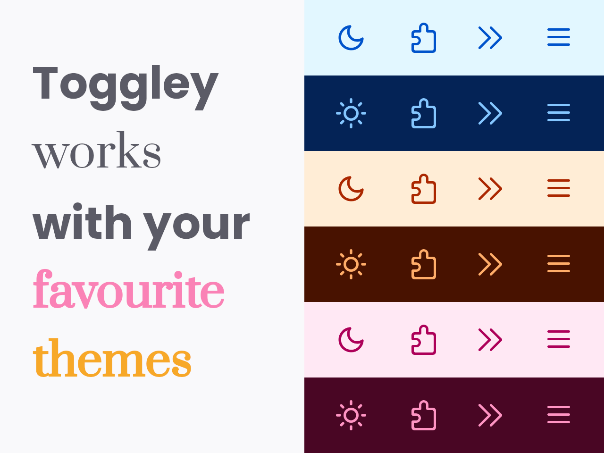

# Toggley

  
  

---
- A simple button that toggles between your favourite Light and Dark themes.
- This project uses [Feather Icons](https://github.com/feathericons/feather)
- Default shortcut: `Ctrl+Alt+0`
> See [Manage extension shortcuts in Firefox](https://support.mozilla.org/en-US/kb/manage-extension-shortcuts-firefox) for more info.
---

